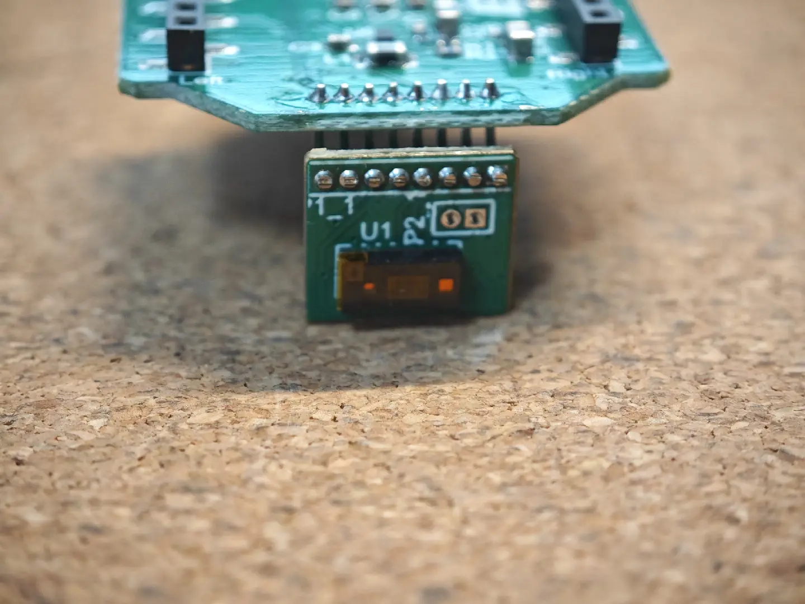
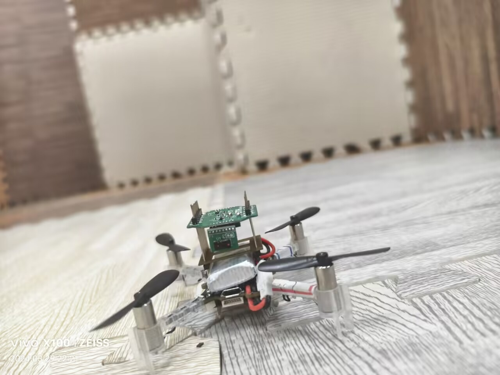

# Athena v3.2 efficiency Firmware
## introduction
**Athena (Co-processing deck)** is a computational expansion board independently developed by SEU-NetSI. It is designed to be compatible with any micro unmanned systems worldwide. In the future, as devices like drones, unmanned vehicles, and robots continue to miniaturize, Athena will provide these systems with higher computational power and larger memory capacity. At the same time, by leveraging ST’s low-power chips, it ensures energy efficiency.

**Software and Hardware Frame of Athena**
## Demonstration of SLAM
Our academic work is currently in the submission stage, so we are unable to open source the hardware at this time. However, this project includes the open sourcing of software related to SLAM, comprising three parts: the driver for the VL53L5 TOF sensor, the calibration of the TOF sensor, and the SLAM algorithm.
Here are some images that can showcase our achievements.
1. TOF-deck using VL53L5

2. The MAV "Crazyflie" loading the TOF-deck

3. We use L496 to drive the TOF-deck

## Software Update Log
### v0.1
1. I2C transmit with DMA **@Hanjie**
2. slam-deck & I2C-expander BSP **@Hanjie**
3. FreeRTOS **@Hanjie**
### v0.1.1
Increased throughput of I2C using fast I/O speed & dual DMA buffer **@Hanjie**
### v0.2
1. slam-deck driver **@Hanjie**
2. SPI exchange with DMA **@Hanjie @Yunfan**
3. W25Q64 BSP **@Yunfan @Hanjie**
### v0.3
1. USART Tranmit with DMA LL **@Hao Li @Hanjie**
2. USART Receive with Interrupt+callback+semphr **@Hanjie @Hao Li**
## Hardware Update Log
### v3.2
STM32L496 + W25Q512 @8MHz
## How to use
git clone
## TBD
1. I2C semphr
2. FreeRTOS multi task
3. SPI speed up
4. printf reconstruct
## Contributors
@Hanjie Yu

@Yunfan Li

@Hao Li

@Yunxi Hou

@Feng Shan

**National Natural Science Foundation of China (6509009672)**

